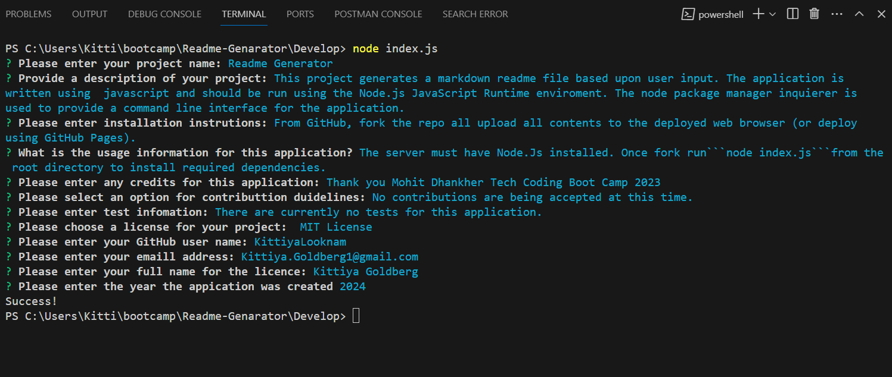

# Readme-Genarator
A Node.js command line tool for creating a readme file

# Description 
This is a simple node application that generates a README.md file based on user input from using Javascript and Should be run using the Nodejs JavaScript runtime environment. The node package manager inquirer package is used to provide a command line interface for the application.

# Table of Contents
- Installation
- Usage
- Credits
- License
- Contributing
- Tests
- Questions

#  Installation
From GitHub, fork the repo all upload all contents to the deployed webserver (or deploy using GitHub Pages). The server must have Node.js installed. Once forked, run npm i from the root directory to install required dependencies.

link to the repository : https://github.com/KittiyaLooknam/Readme-Genarator.git

# Usage
From the application's root directory, run node index.js. Follow the user prompts to provide content for the readme file. Upon completion, the application will generate a new file, SAMPLE_README.md, in the root directory.

Link to the video Demo 
https://youtu.be/T6YE1UwVvBQ

# Credits 
Thank you Mohit Dhankher and Louis Delia Tech Bootcamp Coding

# References 
https://www.npmjs.com/package/inquirer#documentation 

https://nodejs.org/en/docs/guides/getting-started-guide
# License
This project is licensed under the MIT license.

# Questions 
If you have any questions about this repo, please feel free to contact me at my email : kittiya.goldberg1@gmail.com and Github profile : KittiyaLooknam

